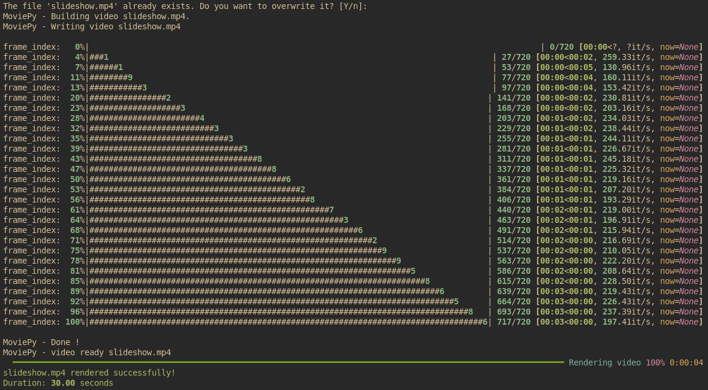

`sly` is a lightweight and flexible command-line tool for creating slideshows from your image collections. With support for tansition effect, soundtrack, and title slide, `sly` makes it easy to quickly turn your photos into nice-looking videos.

## Features

- Create slideshows from a folder of images
- Customize image and transition duration
- Add background music to your slideshow
- Include a title slide with custom font
- Support for various image ordering options (by name, date, or random)
- Adjustable output resolution and frame rate
- Progress bar for real-time rendering updates

## Installation

### Prerequisites

Make sure you have the following installed:

- Python 3.7+
- FFmpeg

### Manual Installation

Clone the repository:

   ```bash
   git clone https://github.com/mwmdev/sly.git
   cd sly
   ```

Create and activate a virtual environment:

   ```bash
   python3 -m venv venv
   source venv/bin/activate # or .\venv\Scripts\activate on Windows
   ```

Install the required Python packages:

   ```bash
   pip install -r requirements.txt
   ```

### Using Nix

If you're using _NixOS_ or have the _Nix_ package manager installed, you can use the provided `shell.nix` file to set up the environment.

## Usage

Basic usage:

```bash
python sly.py --path ./path/to/images --output ./path/to/output.mp4
```

### Options

- `--path`, `-p`: Path to the images directory (default: current directory)
- `--image-duration`, `-id`: The number of seconds each image will be displayed
- `--image-order`, `-io`: Order of images (choices: name, date, random)
- `--transition-duration`, `-td`: The number of seconds the transition effect will take to complete
- `--slideshow-width`, `-sw`: The width of the slideshow in pixels
- `--slideshow-height`, `-sh`: The height of the slideshow in pixels
- `--output`, `-o`: The name of the output file
- `--title`: The title of the slideshow 
- `--font`: Path to a .ttf font file for the title    
- `--font-size`: The size of the font for the title 
- `--soundtrack`, `-st`: The path to the audio file for the soundtrack 
- `--fps`: The number of frames per second for the output video (default: 24.0)
- `--config`, `-c`: Path to a custom config file 
- `--verbose`, `-v`: Print more information

Default values are loaded from `config.toml` file in the current directory or in `~/.config/sly/config.toml` if the file is not found in the current directory.


### Examples

1. Create a slideshow with default settings:
   ```bash
   python sly.py --path /path/to/vacation/photos
   ```

2. Create a slideshow with custom duration and random order:
   ```bash
   python sly.py --path /path/to/photos --image-duration 3 --image-order random
   ```

3. Create a slideshow with a title and a custom font:
   ```bash
   python sly.py --path /path/to/photos --title "Summer Vacation 2023" --font /path/to/font.ttf --font-size 48
   ```

4. Create a high-resolution slideshow with custom FPS:
   ```bash
   python sly.py --path /path/to/photos --slideshow-width 3840 --slideshow-height 2160 --fps 30
   ```

5. Create a slideshow with a soundtrack:
   ```bash
   python sly.py --path /path/to/photos --soundtrack /path/to/soundtrack.mp3
   ```

### Sample output

Here's a sample output from the command below:

```bash
python sly.py -p img -sw 400 -sh 300 -id 3 -td 1 -t "Live Free" -f fonts/HomemadeApple-Regular.ttf -fs 50
```

Terminal output:



Rendered video:


## Contributing

Contributions are welcome! Please feel free to submit a Pull Request.

## License

This project is licensed under the MIT License - see the [LICENSE](LICENSE) file for details.

## Acknowledgments

- [MoviePy](https://zulko.github.io/moviepy/) for video editing capabilities
- [Pillow](https://python-pillow.org/) for image processing
- [Rich](https://rich.readthedocs.io/) for beautiful terminal output
- [FFmpeg](https://ffmpeg.org/) for video encoding

## Support

If you encounter any problems or have any suggestions, please open an issue on the GitHub repository.

---

Happy slideshow creating with sly!
